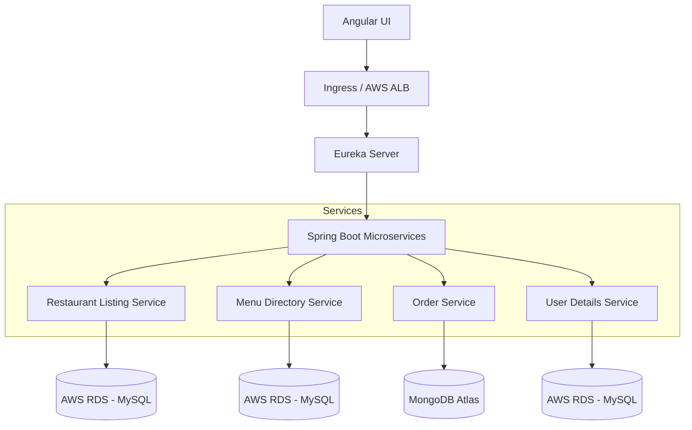

# food-on-wheels-app
## Overview
This project is a full-stack, cloud native food delivery application that simulates food delivery with features like  restaurant listing, restaurant registration, user sign-up and much more. This is being developed as part of a learning curriculum based on multiple Udemy courses, with enhancements and customizations added along the way.

## Tech Stack:

| Category | Stack |
|-----------|-------|
| **Backend** | Spring Boot, REST, Microservices, JUnit |
| **Frontend** | Angular |
| **Databases** | AWS RDS (MySQL), MongoDB Atlas |
| **DevOps / CI/CD** | Docker, Kubernetes, Jenkins, ArgoCD, SonarQube |
| **Cloud Infrastructure** | AWS EKS, EC2, ALB, RDS |
| **Unit Tests** | JUnit |
| **API Documentation** | Swagger UI |
| **Version Control** | GitHub |


---

## Architecture



```mermaid
graph LR
    DEV[Developer] --> GIT[GitHub]
    GIT --> JENK[Jenkins EC2]
    JENK --> SONAR[SonarQube]
    JENK --> DOCKER[DockerHub (tejassrivathsa)]
    DOCKER --> ARGO[ArgoCD (EKS)]
    ARGO --> EKS[EKS Cluster (Pods + Services)]
    EKS --> RDS[(AWS RDS - MySQL)]
    EKS --> MONGO[(MongoDB Atlas)]
    USER[End User / Angular UI] --> ALB[AWS ALB]
    ALB --> EKS
```


---


## Architecture Highlights
- Modular microservices using Spring Boot REST APIs
- Centralized service discovery via Eureka
- Angular single-page application frontend
- Dual database architecture: AWS RDS (MySQL) and MongoDB Atlas
- Kubernetes-based orchestration on AWS EKS
- Continuous delivery via Jenkins and ArgoCD
- Code quality management with SonarQube

The frontend (Angular) consumes REST APIs exposed by the gateway.

---

## Setup Instructions

### Prerequisites
- Java 17+
- Node.js + Angular CLI
- Docker
- MySQL
- AWS

## Deployment Workflow
1. Developer pushes code to GitHub.  
2. Jenkins (running on EC2) builds and tests the project with JUnit and analyzes it through SonarQube.  
3. Docker images are published to DockerHub (`tejassrivathsa/*`).  
4. ArgoCD, deployed on EKS, syncs manifests from the `fow-infra` repository.  
5. AWS ALB routes requests to services running in EKS.


---


| Component              | Description                                |
|----------------------|--------------------------------------------|
| eureka-server	       | Eureka service registry                    |
| restaurant-listing-service   | Restaurant information 		    |
| menu-directory-service       | All menus			            |
| user-details-service         | User accounts and profiles         	    |
| order-service        | Cart, orders, and checkout         	    |
| fow-ui-app      | Angular front-end                   |
| fow-infra      | Angular front-end                   |

## Features (Work in Progress)

- User Signup/Login  
- Restaurant Listing  
- Cart Management   
- Admin Restaurant Portal  
- Payment Simulation  

---

## Learning Goals

This project is part of a hands-on learning journey, aiming to:
- Understand microservices design patterns
- Implement event-driven architecture using Kafka
- Practice DevOps fundamentals (Docker, CI/CD)
- Strengthen frontend-backend integration using Angular and REST APIs


---

## Author

Tejas Srivathsa  
Connect on [LinkedIn](https://www.linkedin.com/in/tejas-s-405237169/)  

---

## License
This project is for educational purposes only.
